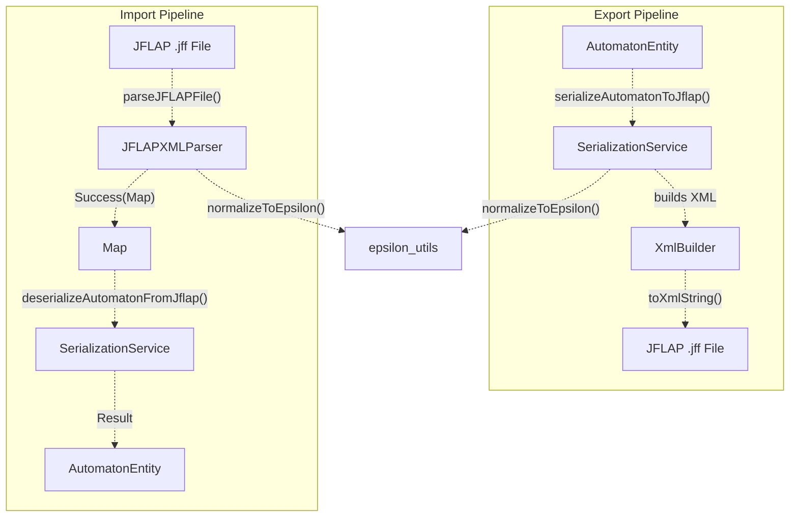
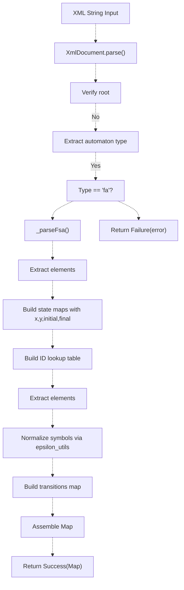
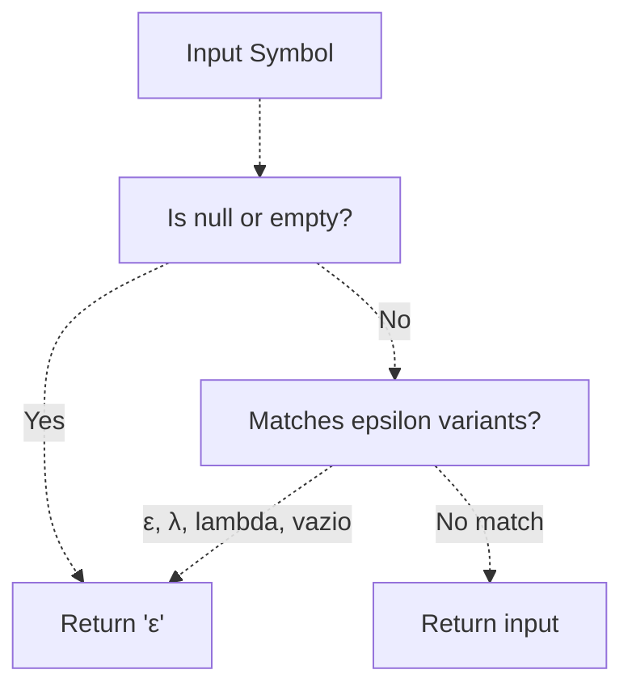
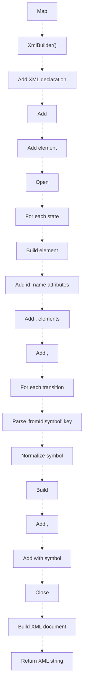
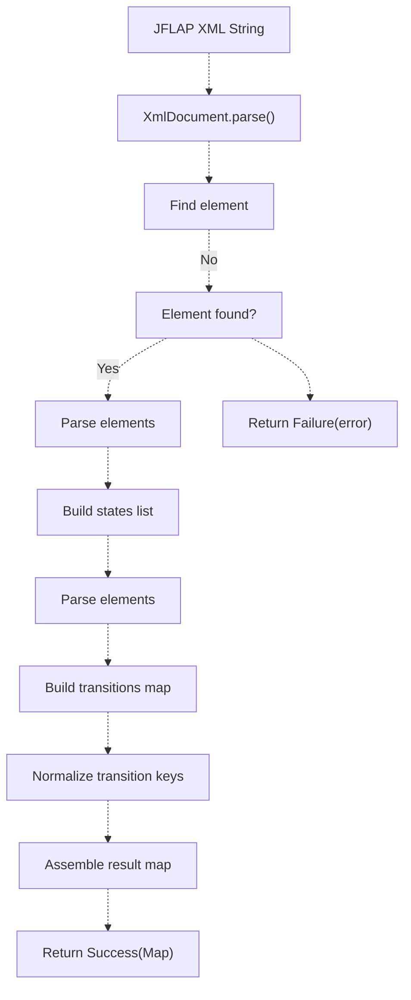
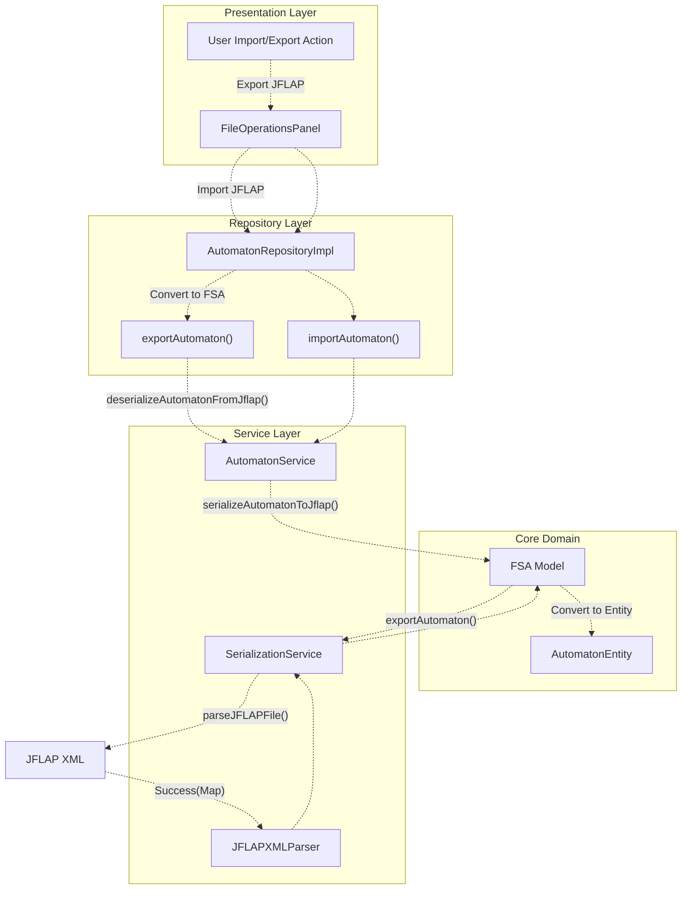

# JFLAP Interoperability

> **Relevant source files**
> * [lib/core/entities/automaton_entity.dart](https://github.com/ThalesMMS/JFlutter/blob/32e808b4/lib/core/entities/automaton_entity.dart)
> * [lib/core/parsers/jflap_xml_parser.dart](https://github.com/ThalesMMS/JFlutter/blob/32e808b4/lib/core/parsers/jflap_xml_parser.dart)
> * [lib/data/repositories/automaton_repository_impl.dart](https://github.com/ThalesMMS/JFlutter/blob/32e808b4/lib/data/repositories/automaton_repository_impl.dart)
> * [lib/data/services/automaton_service.dart](https://github.com/ThalesMMS/JFlutter/blob/32e808b4/lib/data/services/automaton_service.dart)
> * [lib/data/services/serialization_service.dart](https://github.com/ThalesMMS/JFlutter/blob/32e808b4/lib/data/services/serialization_service.dart)
> * [lib/presentation/pages/fsa_page.dart](https://github.com/ThalesMMS/JFlutter/blob/32e808b4/lib/presentation/pages/fsa_page.dart)
> * [lib/presentation/pages/grammar_page.dart](https://github.com/ThalesMMS/JFlutter/blob/32e808b4/lib/presentation/pages/grammar_page.dart)
> * [lib/presentation/pages/pda_page.dart](https://github.com/ThalesMMS/JFlutter/blob/32e808b4/lib/presentation/pages/pda_page.dart)
> * [lib/presentation/pages/pumping_lemma_page.dart](https://github.com/ThalesMMS/JFlutter/blob/32e808b4/lib/presentation/pages/pumping_lemma_page.dart)
> * [lib/presentation/pages/regex_page.dart](https://github.com/ThalesMMS/JFlutter/blob/32e808b4/lib/presentation/pages/regex_page.dart)
> * [lib/presentation/pages/tm_page.dart](https://github.com/ThalesMMS/JFlutter/blob/32e808b4/lib/presentation/pages/tm_page.dart)
> * [lib/presentation/widgets/tablet_layout_container.dart](https://github.com/ThalesMMS/JFlutter/blob/32e808b4/lib/presentation/widgets/tablet_layout_container.dart)
> * [test/core/services/simulation_highlight_service_test.dart](https://github.com/ThalesMMS/JFlutter/blob/32e808b4/test/core/services/simulation_highlight_service_test.dart)
> * [test/integration/io/examples_roundtrip_test.dart](https://github.com/ThalesMMS/JFlutter/blob/32e808b4/test/integration/io/examples_roundtrip_test.dart)
> * [test/integration/io/interoperability_roundtrip_test.dart](https://github.com/ThalesMMS/JFlutter/blob/32e808b4/test/integration/io/interoperability_roundtrip_test.dart)
> * [test/tablet_layout_test.dart](https://github.com/ThalesMMS/JFlutter/blob/32e808b4/test/tablet_layout_test.dart)

## Purpose and Scope

This page documents JFlutter's interoperability with JFLAP (Java Formal Languages and Automata Package), focusing on the XML parsing, serialization, and epsilon symbol normalization systems that enable bidirectional conversion between JFLAP `.jff` files and JFlutter's internal representations. For general file I/O operations and the user-facing import/export interface, see [File Operations Panel](#9.1). For the broader serialization architecture covering JSON and other formats, see [Serialization Service](#9.2).

JFlutter maintains compatibility with JFLAP through a dedicated parser and serialization layer that handles:

* JFLAP XML format reading and writing
* Epsilon/lambda transition symbol normalization
* State and transition structure mapping
* Round-trip data integrity validation

---

## JFLAP XML Format Overview

JFLAP uses an XML-based format (`.jff` files) to represent finite automata, grammars, and Turing machines. JFlutter supports the finite automaton subset with the following structure:

### XML Document Structure

```xml
<?xml version="1.0" encoding="UTF-8"?><structure type="fa">  <type>fa</type>  <automaton>    <state id="q0" name="q0">      <x>100.0</x>      <y>150.0</y>      <initial/>      <final/>    </state>    <transition>      <from>q0</from>      <to>q1</to>      <read>a</read>    </transition>  </automaton></structure>
```

| Element | Purpose | Attributes/Children |
| --- | --- | --- |
| `<structure>` | Root element | `type` attribute specifies automaton type (`fa`, `cfg`, etc.) |
| `<type>` | Type declaration | Text content duplicates the type |
| `<automaton>` | Container for automaton definition | Contains all states and transitions |
| `<state>` | State definition | `id`, `name` attributes; optional `<x>`, `<y>`, `<initial/>`, `<final/>` |
| `<transition>` | Transition definition | Contains `<from>`, `<to>`, `<read>` elements |
| `<read>` | Transition symbol | Text content is the input symbol; empty or `ε` for epsilon |

**Sources:** [lib/core/parsers/jflap_xml_parser.dart L1-L144](https://github.com/ThalesMMS/JFlutter/blob/32e808b4/lib/core/parsers/jflap_xml_parser.dart#L1-L144)

 [lib/data/services/serialization_service.dart L18-L103](https://github.com/ThalesMMS/JFlutter/blob/32e808b4/lib/data/services/serialization_service.dart#L18-L103)

---

## Parser Architecture

### Component Diagram



**Sources:** [lib/core/parsers/jflap_xml_parser.dart L16-L144](https://github.com/ThalesMMS/JFlutter/blob/32e808b4/lib/core/parsers/jflap_xml_parser.dart#L16-L144)

 [lib/data/services/serialization_service.dart L15-L307](https://github.com/ThalesMMS/JFlutter/blob/32e808b4/lib/data/services/serialization_service.dart#L15-L307)

### JFLAPXMLParser

The `JFLAPXMLParser` class provides a static method `parseJFLAPFile()` that converts JFLAP XML into JFlutter's internal map representation:

| Method | Return Type | Purpose |
| --- | --- | --- |
| `parseJFLAPFile(String xmlContent)` | `Result<Map<String, dynamic>>` | Parses JFLAP XML and returns structured data |
| `_parseFsa(XmlElement root)` | `Result<Map<String, dynamic>>` | Handles finite automaton parsing specifically |

The parser validates the XML structure, extracts state and transition data, and normalizes all epsilon variants to the canonical `ε` symbol.

**Sources:** [lib/core/parsers/jflap_xml_parser.dart L16-L144](https://github.com/ThalesMMS/JFlutter/blob/32e808b4/lib/core/parsers/jflap_xml_parser.dart#L16-L144)

### Parsing Flow



**Sources:** [lib/core/parsers/jflap_xml_parser.dart L19-L143](https://github.com/ThalesMMS/JFlutter/blob/32e808b4/lib/core/parsers/jflap_xml_parser.dart#L19-L143)

### State Parsing Details

States are parsed from `<state>` elements with the following logic:

1. Extract `id` attribute (falls back to `name` attribute if missing)
2. Extract `name` attribute (defaults to `id` if missing)
3. Parse `x` and `y` coordinates from attributes or child elements
4. Check for `<initial/>` and `<final/>` marker elements
5. Build ID lookup table mapping both `id` and `name` to the canonical state ID

**Sources:** [lib/core/parsers/jflap_xml_parser.dart L65-L98](https://github.com/ThalesMMS/JFlutter/blob/32e808b4/lib/core/parsers/jflap_xml_parser.dart#L65-L98)

### Transition Parsing Details

Transitions are extracted from `<transition>` elements:

1. Read `<from>` and `<to>` elements for source and destination state IDs
2. Resolve state IDs using the ID lookup table
3. Extract `<read>` element text (may be empty for epsilon)
4. Normalize the symbol using `normalizeToEpsilon()`
5. Build transition key as `"fromId|symbol"`
6. Group transitions by key, collecting destination states in a list

**Sources:** [lib/core/parsers/jflap_xml_parser.dart L100-L126](https://github.com/ThalesMMS/JFlutter/blob/32e808b4/lib/core/parsers/jflap_xml_parser.dart#L100-L126)

---

## Epsilon Symbol Normalization

JFLAP and other tools use various representations for epsilon transitions. JFlutter normalizes all variants to the canonical Greek epsilon character `ε`.

### Normalization Table

| Input Representation | Normalized Output | Source/Context |
| --- | --- | --- |
| `""` (empty string) | `ε` | JFLAP epsilon transitions |
| `"ε"` | `ε` | Greek epsilon (U+03B5) |
| `"λ"` | `ε` | Greek lambda (U+03BB) |
| `"lambda"` | `ε` | Text representation |
| `"vazio"` | `ε` | Portuguese "empty" |
| `null` | `ε` | Missing transition symbol |

The normalization is handled by functions in `epsilon_utils.dart`:

| Function | Signature | Purpose |
| --- | --- | --- |
| `normalizeToEpsilon(String?)` | `String` | Converts any epsilon variant to canonical `ε` |
| `isEpsilonSymbol(String)` | `bool` | Checks if a string represents epsilon |
| `extractStateIdFromTransitionKey(String)` | `String` | Extracts state ID from `"stateId\|symbol"` keys |
| `extractSymbolFromTransitionKey(String)` | `String` | Extracts symbol from `"stateId\|symbol"` keys |

**Sources:** [lib/core/utils/epsilon_utils.dart L1-L50](https://github.com/ThalesMMS/JFlutter/blob/32e808b4/lib/core/utils/epsilon_utils.dart#L1-L50)

 (inferred from usage), [lib/data/services/serialization_service.dart L199-L201](https://github.com/ThalesMMS/JFlutter/blob/32e808b4/lib/data/services/serialization_service.dart#L199-L201)

### Normalization Flow Diagram



**Sources:** [test/integration/io/interoperability_roundtrip_test.dart L138-L190](https://github.com/ThalesMMS/JFlutter/blob/32e808b4/test/integration/io/interoperability_roundtrip_test.dart#L138-L190)

 [lib/data/services/serialization_service.dart L199-L201](https://github.com/ThalesMMS/JFlutter/blob/32e808b4/lib/data/services/serialization_service.dart#L199-L201)

### Epsilon Handling in Round-Trip Tests

The test suite validates epsilon normalization across multiple scenarios:

```xml
Test: JFF handles NFA with epsilon transitions
  Input: NFA with ε transitions
  Expected: <read>ε</read> in XML
  Validation: Round-trip preserves epsilon transitions as 'ε'

Test: JFF normalizes epsilon aliases consistently
  Input: Automaton with λ, vazio, and empty string transitions
  Expected: All normalized to ε in both XML and internal format
  Validation: All three representations map to 'q0|ε' and 'q1|ε' keys
```

**Sources:** [test/integration/io/interoperability_roundtrip_test.dart L97-L190](https://github.com/ThalesMMS/JFlutter/blob/32e808b4/test/integration/io/interoperability_roundtrip_test.dart#L97-L190)

---

## Serialization and Deserialization

The `SerializationService` class provides bidirectional conversion between JFlutter's internal automaton representation and JFLAP XML format.

### SerializationService Methods

| Method | Parameters | Return Type | Purpose |
| --- | --- | --- | --- |
| `serializeAutomatonToJflap()` | `Map<String, dynamic>` | `String` | Converts internal map to JFLAP XML |
| `deserializeAutomatonFromJflap()` | `String` | `Result<Map<String, dynamic>>` | Parses JFLAP XML to internal map |
| `serializeAutomatonToJson()` | `Map<String, dynamic>` | `String` | Converts to JSON format |
| `deserializeAutomatonFromJson()` | `String` | `Result<Map<String, dynamic>>` | Parses JSON format |
| `roundTripTest()` | `Map, SerializationFormat` | `Result<Map>` | Tests format conversion integrity |
| `validateRoundTrip()` | `Map, Map` | `bool` | Validates structural equivalence |

**Sources:** [lib/data/services/serialization_service.dart L15-L297](https://github.com/ThalesMMS/JFlutter/blob/32e808b4/lib/data/services/serialization_service.dart#L15-L297)

### Serialization to JFLAP XML

The serialization process builds JFLAP-compliant XML using `XmlBuilder`:



**Sources:** [lib/data/services/serialization_service.dart L18-L103](https://github.com/ThalesMMS/JFlutter/blob/32e808b4/lib/data/services/serialization_service.dart#L18-L103)

### XML Building Code Structure

The serialization method at [lib/data/services/serialization_service.dart L18-L103](https://github.com/ThalesMMS/JFlutter/blob/32e808b4/lib/data/services/serialization_service.dart#L18-L103)

 constructs XML elements hierarchically:

1. **Processing instruction**: `<?xml version="1.0" encoding="UTF-8"?>`
2. **Structure element**: `<structure type="fa">` with automaton type
3. **States**: Each state gets attributes and optional child elements for position and markers
4. **Transitions**: Built from the transitions map, parsing keys and normalizing symbols
5. **Pretty printing**: XML is formatted with indentation via `pretty: true`

**Sources:** [lib/data/services/serialization_service.dart L18-L103](https://github.com/ThalesMMS/JFlutter/blob/32e808b4/lib/data/services/serialization_service.dart#L18-L103)

### Deserialization from JFLAP XML

Deserialization reverses the process, parsing XML back to internal format:



**Sources:** [lib/data/services/serialization_service.dart L105-L197](https://github.com/ThalesMMS/JFlutter/blob/32e808b4/lib/data/services/serialization_service.dart#L105-L197)

### Result Data Structure

After deserialization, the returned map contains:

```
{
  'states': [
    {
      'id': 'q0',
      'name': 'q0',
      'x': 100.0,
      'y': 150.0,
      'isInitial': true,
      'isFinal': false
    },
    ...
  ],
  'transitions': {
    'q0|a': ['q1'],
    'q0|ε': ['q2'],
    ...
  },
  'initialId': 'q0',
  'type': 'fa'
}
```

This structure is then consumed by repository implementations to create `AutomatonEntity` instances.

**Sources:** [lib/data/services/serialization_service.dart L186-L196](https://github.com/ThalesMMS/JFlutter/blob/32e808b4/lib/data/services/serialization_service.dart#L186-L196)

---

## Round-Trip Testing and Data Integrity

JFlutter includes comprehensive integration tests to ensure JFLAP interoperability maintains data integrity through import/export cycles.

### Test Coverage Matrix

| Test Category | Test Cases | Validation Focus |
| --- | --- | --- |
| JFF Format Tests | 7 tests | XML structure, parsing, epsilon handling |
| JSON Format Tests | 5 tests | JSON serialization, parsing, validation |
| SVG Export Tests | 9 tests | Visual export integrity |
| Cross-Format Tests | 3 tests | JFF↔JSON conversion, multi-format round-trips |
| Data Integrity Tests | 3 tests | Property preservation, structural validation |

**Sources:** [test/integration/io/interoperability_roundtrip_test.dart L26-L700](https://github.com/ThalesMMS/JFlutter/blob/32e808b4/test/integration/io/interoperability_roundtrip_test.dart#L26-L700)

### Round-Trip Test Flow

```mermaid
flowchart TD

Start["Original Data"]
JFF1["→ JFLAP XML"]
JSON["→ JSON"]
JFF2["→ JFLAP XML"]
Final["Final Data"]
Compare["Compare Original vs Final"]
OrigMap["Original Map"]
ToJFF["serializeAutomatonToJflap()"]
JFFXml["JFLAP XML String"]
FromJFF["deserializeAutomatonFromJflap()"]
ResultMap["Result Map"]
Validate["validateRoundTrip()"]

subgraph subGraph1 ["Multi-Format Round-Trip"]
    Start
    JFF1
    JSON
    JFF2
    Final
    Compare
    Start -.-> JFF1
    JFF1 -.-> JSON
    JSON -.-> JFF2
    JFF2 -.-> Final
    Final -.-> Compare
end

subgraph subGraph0 ["Basic Round-Trip"]
    OrigMap
    ToJFF
    JFFXml
    FromJFF
    ResultMap
    Validate
    OrigMap -.-> ToJFF
    ToJFF -.-> JFFXml
    JFFXml -.-> FromJFF
    FromJFF -.-> ResultMap
    ResultMap -.-> Validate
end
```



**Sources:** [test/integration/io/interoperability_roundtrip_test.dart L610-L650](https://github.com/ThalesMMS/JFlutter/blob/32e808b4/test/integration/io/interoperability_roundtrip_test.dart#L610-L650)

 [lib/data/services/serialization_service.dart L258-L296](https://github.com/ThalesMMS/JFlutter/blob/32e808b4/lib/data/services/serialization_service.dart#L258-L296)

### Key Test Scenarios

#### Epsilon Transition Preservation

Test at [test/integration/io/interoperability_roundtrip_test.dart L97-L136](https://github.com/ThalesMMS/JFlutter/blob/32e808b4/test/integration/io/interoperability_roundtrip_test.dart#L97-L136)

 verifies:

1. NFA with epsilon transitions serializes with `<read>ε</read>`
2. Deserialization correctly identifies epsilon transitions
3. Transition map contains `'q0|ε'` keys pointing to target states

#### Epsilon Alias Normalization

Test at [test/integration/io/interoperability_roundtrip_test.dart L138-L190](https://github.com/ThalesMMS/JFlutter/blob/32e808b4/test/integration/io/interoperability_roundtrip_test.dart#L138-L190)

 validates:

1. Input automaton with `λ`, `vazio`, and empty string transitions
2. Serialization converts all variants to `<read>ε</read>`
3. Count of `<read>ε</read>` tags equals total epsilon transitions
4. Deserialized transitions map normalizes to `'q0|ε'` and `'q1|ε'` keys

#### Empty Automaton Stability

Test at [test/integration/io/interoperability_roundtrip_test.dart L222-L247](https://github.com/ThalesMMS/JFlutter/blob/32e808b4/test/integration/io/interoperability_roundtrip_test.dart#L222-L247)

 ensures:

1. Empty automaton (no states/transitions) exports valid JFLAP XML
2. XML contains `<automaton>` element (not self-closing)
3. Round-trip through both JFLAP and JSON preserves emptiness
4. No transitions map or states list corruption

**Sources:** [test/integration/io/interoperability_roundtrip_test.dart L97-L247](https://github.com/ThalesMMS/JFlutter/blob/32e808b4/test/integration/io/interoperability_roundtrip_test.dart#L97-L247)

### Validation Criteria

The `validateRoundTrip()` method at [lib/data/services/serialization_service.dart L288-L296](https://github.com/ThalesMMS/JFlutter/blob/32e808b4/lib/data/services/serialization_service.dart#L288-L296)

 performs basic structural validation:

* State count preservation
* Transition count preservation
* Type preservation
* Alphabet preservation (where applicable)

More comprehensive validation occurs in the integration tests, which check:

* State IDs and properties
* Transition keys and target lists
* Initial/final state markers
* Position coordinates

**Sources:** [lib/data/services/serialization_service.dart L288-L296](https://github.com/ThalesMMS/JFlutter/blob/32e808b4/lib/data/services/serialization_service.dart#L288-L296)

 [test/integration/io/interoperability_roundtrip_test.dart L653-L700](https://github.com/ThalesMMS/JFlutter/blob/32e808b4/test/integration/io/interoperability_roundtrip_test.dart#L653-L700)

---

## Integration with File I/O System

JFLAP interoperability integrates with JFlutter's broader file I/O architecture through repository and service layers.

### Data Flow Architecture



**Sources:** [lib/data/repositories/automaton_repository_impl.dart L88-L115](https://github.com/ThalesMMS/JFlutter/blob/32e808b4/lib/data/repositories/automaton_repository_impl.dart#L88-L115)

 [lib/data/services/automaton_service.dart L211-L245](https://github.com/ThalesMMS/JFlutter/blob/32e808b4/lib/data/services/automaton_service.dart#L211-L245)

 [lib/data/services/serialization_service.dart L15-L307](https://github.com/ThalesMMS/JFlutter/blob/32e808b4/lib/data/services/serialization_service.dart#L15-L307)

### Repository Export Flow

When a user exports an automaton to JFLAP format:

1. **FileOperationsPanel** triggers export action
2. **AutomatonRepositoryImpl.exportAutomaton()** receives `AutomatonEntity`
3. Repository converts entity to `FSA` model via `_convertEntityToFsa()`
4. **AutomatonService.exportAutomaton()** serializes FSA to JSON (internal format)
5. For JFLAP export, **SerializationService.serializeAutomatonToJflap()** converts to XML
6. XML string is saved to file via platform file pickers

**Sources:** [lib/data/repositories/automaton_repository_impl.dart L88-L101](https://github.com/ThalesMMS/JFlutter/blob/32e808b4/lib/data/repositories/automaton_repository_impl.dart#L88-L101)

 [lib/data/services/automaton_service.dart L211-L219](https://github.com/ThalesMMS/JFlutter/blob/32e808b4/lib/data/services/automaton_service.dart#L211-L219)

### Repository Import Flow

When a user imports a JFLAP file:

1. **FileOperationsPanel** reads file content
2. **JFLAPXMLParser.parseJFLAPFile()** parses XML to map
3. **SerializationService.deserializeAutomatonFromJflap()** validates structure
4. **AutomatonService.importAutomaton()** converts to `FSA` model (if using JSON path)
5. **AutomatonRepositoryImpl** converts `FSA` to `AutomatonEntity`
6. Entity is loaded into the active provider (AutomatonProvider, TMEditorProvider, etc.)

**Sources:** [lib/data/repositories/automaton_repository_impl.dart L103-L115](https://github.com/ThalesMMS/JFlutter/blob/32e808b4/lib/data/repositories/automaton_repository_impl.dart#L103-L115)

 [lib/core/parsers/jflap_xml_parser.dart L16-L144](https://github.com/ThalesMMS/JFlutter/blob/32e808b4/lib/core/parsers/jflap_xml_parser.dart#L16-L144)

### Entity-to-Map Conversion

The conversion between `AutomatonEntity` and the internal map format used by serialization services occurs in `AutomatonRepositoryImpl`:

| Method | Direction | Key Transformations |
| --- | --- | --- |
| `_convertEntityToRequest()` | Entity → Request | Extracts states, transitions, builds `CreateAutomatonRequest` |
| `_convertFsaToEntity()` | FSA → Entity | Maps FSA model to entity with state/transition extraction |
| `_convertEntityToFsa()` | Entity → FSA | Builds FSA model with `Vector2` positions, `State` objects |

The serialization service operates on `Map<String, dynamic>` data structures, which are format-agnostic intermediate representations.

**Sources:** [lib/data/repositories/automaton_repository_impl.dart L132-L329](https://github.com/ThalesMMS/JFlutter/blob/32e808b4/lib/data/repositories/automaton_repository_impl.dart#L132-L329)

---

## Error Handling and Validation

JFLAP interoperability includes robust error handling for malformed inputs and validation failures.

### Error Categories

| Error Type | Detection Point | Example |
| --- | --- | --- |
| Malformed XML | `XmlDocument.parse()` | Invalid XML syntax, unclosed tags |
| Missing Structure | `JFLAPXMLParser` | No `<structure>` or `<automaton>` element |
| Unknown Type | Type checking | Unsupported automaton type (e.g., `pda`, `tm`) |
| Invalid State | State parsing | Missing `id` attribute, duplicate IDs |
| Invalid Transition | Transition parsing | Missing `<from>` or `<to>` elements |
| Round-trip Mismatch | Validation tests | State/transition count discrepancies |

**Sources:** [lib/core/parsers/jflap_xml_parser.dart L44-L46](https://github.com/ThalesMMS/JFlutter/blob/32e808b4/lib/core/parsers/jflap_xml_parser.dart#L44-L46)

 [test/integration/io/interoperability_roundtrip_test.dart L192-L202](https://github.com/ThalesMMS/JFlutter/blob/32e808b4/test/integration/io/interoperability_roundtrip_test.dart#L192-L202)

### Result Type Pattern

All parsing and serialization methods return `Result<T>` types:

```
Result<Map<String, dynamic>> parseJFLAPFile(String xmlContent) {  try {    // ... parsing logic    return Success(data);  } catch (e) {    return Failure('Error message: $e');  }}
```

This pattern allows calling code to handle failures gracefully without exceptions propagating up the call stack.

**Sources:** [lib/core/parsers/jflap_xml_parser.dart L19-L47](https://github.com/ThalesMMS/JFlutter/blob/32e808b4/lib/core/parsers/jflap_xml_parser.dart#L19-L47)

 [lib/data/services/serialization_service.dart L106-L197](https://github.com/ThalesMMS/JFlutter/blob/32e808b4/lib/data/services/serialization_service.dart#L106-L197)

### Malformed Input Tests

Test cases at [test/integration/io/interoperability_roundtrip_test.dart L192-L220](https://github.com/ThalesMMS/JFlutter/blob/32e808b4/test/integration/io/interoperability_roundtrip_test.dart#L192-L220)

 verify graceful handling of:

1. **Malformed XML**: `<invalid>xml</invalid>` returns `Failure` with error message
2. **Incomplete XML**: Valid XML structure but missing required elements
3. **Malformed JSON**: `{"invalid": json}` returns `Failure` with error message
4. **Incomplete JSON**: Valid JSON but missing required fields

All failure cases produce descriptive error messages that identify the issue without crashing the application.

**Sources:** [test/integration/io/interoperability_roundtrip_test.dart L192-L370](https://github.com/ThalesMMS/JFlutter/blob/32e808b4/test/integration/io/interoperability_roundtrip_test.dart#L192-L370)

---

## Summary

JFlutter's JFLAP interoperability system provides production-ready XML parsing and serialization with the following characteristics:

* **Bidirectional conversion**: Complete import/export support for JFLAP `.jff` files
* **Epsilon normalization**: Handles multiple epsilon representations (`ε`, `λ`, `lambda`, empty string, `vazio`)
* **Round-trip integrity**: Comprehensive test coverage ensures data preservation across format conversions
* **Error resilience**: Graceful handling of malformed inputs with descriptive error messages
* **Format agnostic**: Service layer operates on intermediate `Map<String, dynamic>` structures, enabling future format support

The system architecture cleanly separates parsing logic (`JFLAPXMLParser`), serialization logic (`SerializationService`), and format conversion logic (repository layer), making it maintainable and extensible.

**Sources:** [lib/core/parsers/jflap_xml_parser.dart L1-L144](https://github.com/ThalesMMS/JFlutter/blob/32e808b4/lib/core/parsers/jflap_xml_parser.dart#L1-L144)

 [lib/data/services/serialization_service.dart L1-L307](https://github.com/ThalesMMS/JFlutter/blob/32e808b4/lib/data/services/serialization_service.dart#L1-L307)

 [test/integration/io/interoperability_roundtrip_test.dart L1-L700](https://github.com/ThalesMMS/JFlutter/blob/32e808b4/test/integration/io/interoperability_roundtrip_test.dart#L1-L700)

Refresh this wiki

Last indexed: 30 December 2025 ([32e808](https://github.com/ThalesMMS/JFlutter/commit/32e808b4))

### On this page

* [JFLAP Interoperability](#9.3-jflap-interoperability)
* [Purpose and Scope](#9.3-purpose-and-scope)
* [JFLAP XML Format Overview](#9.3-jflap-xml-format-overview)
* [XML Document Structure](#9.3-xml-document-structure)
* [Parser Architecture](#9.3-parser-architecture)
* [Component Diagram](#9.3-component-diagram)
* [JFLAPXMLParser](#9.3-jflapxmlparser)
* [Parsing Flow](#9.3-parsing-flow)
* [State Parsing Details](#9.3-state-parsing-details)
* [Transition Parsing Details](#9.3-transition-parsing-details)
* [Epsilon Symbol Normalization](#9.3-epsilon-symbol-normalization)
* [Normalization Table](#9.3-normalization-table)
* [Normalization Flow Diagram](#9.3-normalization-flow-diagram)
* [Epsilon Handling in Round-Trip Tests](#9.3-epsilon-handling-in-round-trip-tests)
* [Serialization and Deserialization](#9.3-serialization-and-deserialization)
* [SerializationService Methods](#9.3-serializationservice-methods)
* [Serialization to JFLAP XML](#9.3-serialization-to-jflap-xml)
* [XML Building Code Structure](#9.3-xml-building-code-structure)
* [Deserialization from JFLAP XML](#9.3-deserialization-from-jflap-xml)
* [Result Data Structure](#9.3-result-data-structure)
* [Round-Trip Testing and Data Integrity](#9.3-round-trip-testing-and-data-integrity)
* [Test Coverage Matrix](#9.3-test-coverage-matrix)
* [Round-Trip Test Flow](#9.3-round-trip-test-flow)
* [Key Test Scenarios](#9.3-key-test-scenarios)
* [Validation Criteria](#9.3-validation-criteria)
* [Integration with File I/O System](#9.3-integration-with-file-io-system)
* [Data Flow Architecture](#9.3-data-flow-architecture)
* [Repository Export Flow](#9.3-repository-export-flow)
* [Repository Import Flow](#9.3-repository-import-flow)
* [Entity-to-Map Conversion](#9.3-entity-to-map-conversion)
* [Error Handling and Validation](#9.3-error-handling-and-validation)
* [Error Categories](#9.3-error-categories)
* [Result Type Pattern](#9.3-result-type-pattern)
* [Malformed Input Tests](#9.3-malformed-input-tests)
* [Summary](#9.3-summary)

Ask Devin about JFlutter