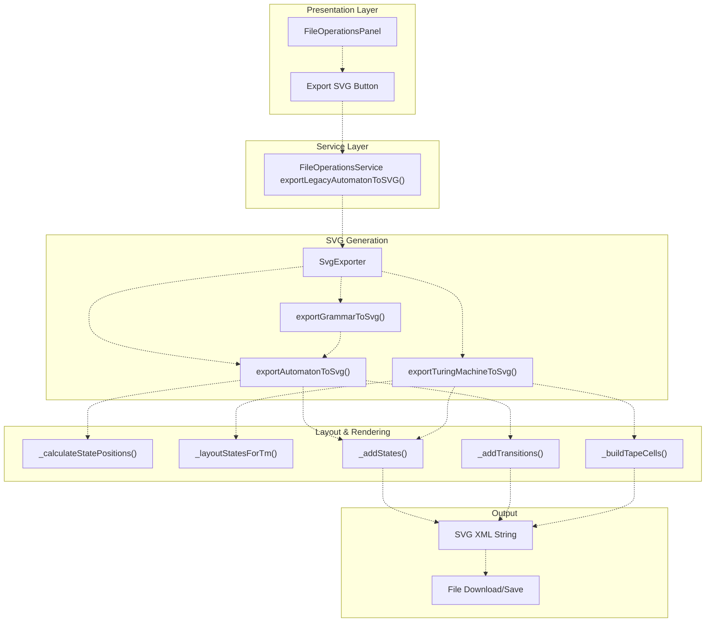
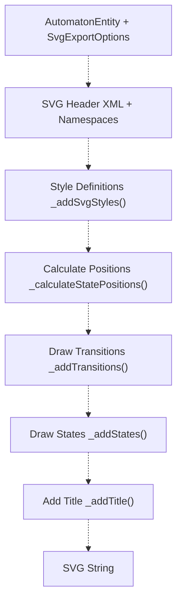
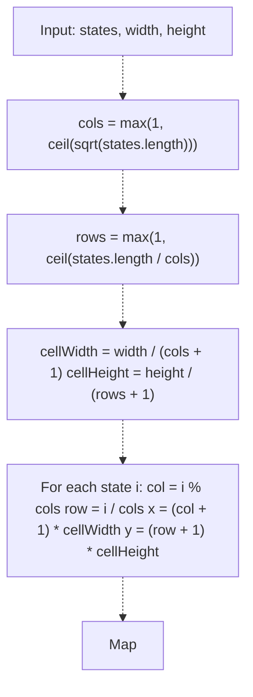
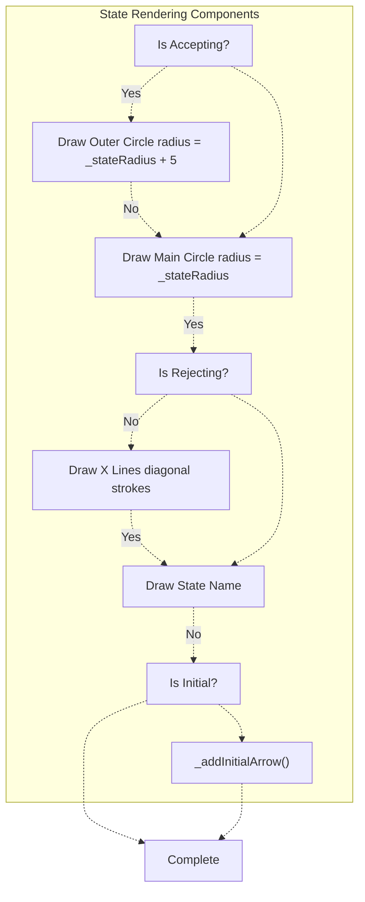
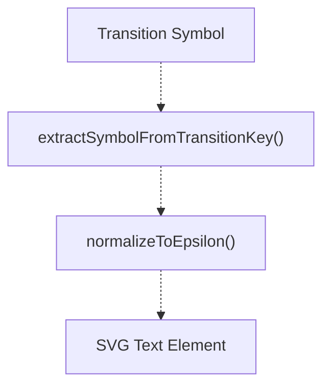
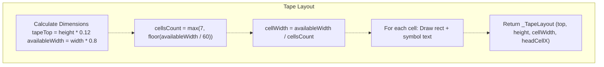
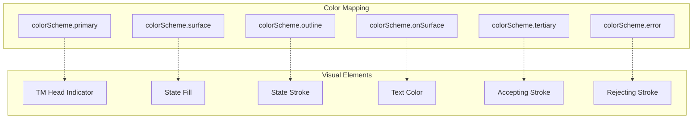
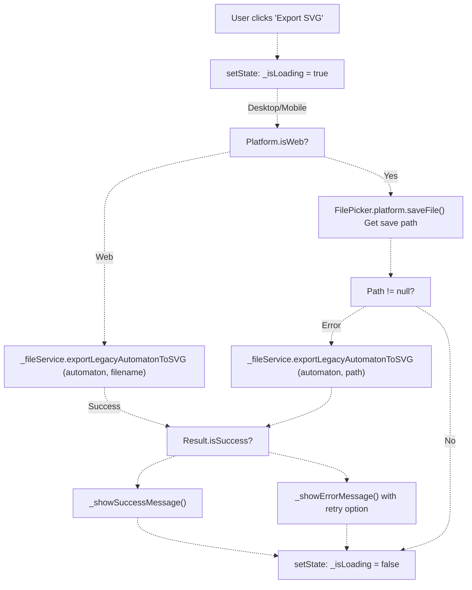

# SVG and Visual Export

> **Relevant source files**
> * [lib/core/entities/automaton_entity.dart](https://github.com/ThalesMMS/JFlutter/blob/32e808b4/lib/core/entities/automaton_entity.dart)
> * [lib/core/utils/epsilon_utils.dart](https://github.com/ThalesMMS/JFlutter/blob/32e808b4/lib/core/utils/epsilon_utils.dart)
> * [lib/data/repositories/automaton_repository_impl.dart](https://github.com/ThalesMMS/JFlutter/blob/32e808b4/lib/data/repositories/automaton_repository_impl.dart)
> * [lib/data/services/automaton_service.dart](https://github.com/ThalesMMS/JFlutter/blob/32e808b4/lib/data/services/automaton_service.dart)
> * [lib/data/services/serialization_service.dart](https://github.com/ThalesMMS/JFlutter/blob/32e808b4/lib/data/services/serialization_service.dart)
> * [lib/presentation/widgets/export/svg_exporter.dart](https://github.com/ThalesMMS/JFlutter/blob/32e808b4/lib/presentation/widgets/export/svg_exporter.dart)
> * [lib/presentation/widgets/file_operations_panel.dart](https://github.com/ThalesMMS/JFlutter/blob/32e808b4/lib/presentation/widgets/file_operations_panel.dart)
> * [test/core/services/simulation_highlight_service_test.dart](https://github.com/ThalesMMS/JFlutter/blob/32e808b4/test/core/services/simulation_highlight_service_test.dart)
> * [test/integration/io/examples_roundtrip_test.dart](https://github.com/ThalesMMS/JFlutter/blob/32e808b4/test/integration/io/examples_roundtrip_test.dart)
> * [test/integration/io/interoperability_roundtrip_test.dart](https://github.com/ThalesMMS/JFlutter/blob/32e808b4/test/integration/io/interoperability_roundtrip_test.dart)

This document describes the SVG (Scalable Vector Graphics) export system that converts automata, grammars, and Turing machines into vector image format. The system generates standalone SVG files with consistent styling, automatic layout algorithms, and customizable visual properties.

For information about the file operations UI and user-facing export workflow, see [File Operations](#9.1). For details about JFLAP XML export format, see [JFLAP Interoperability](#9.3). For the underlying serialization architecture, see [Serialization and Format Conversion](#9.2).

## Overview

The SVG export system is implemented in the `SvgExporter` class, which provides static methods to convert domain entities into SVG markup. The system handles three main types of exports:

| Entity Type | Export Method | Output |
| --- | --- | --- |
| Finite State Automaton | `exportAutomatonToSvg` | States as circles with transitions as arrows |
| Grammar | `exportGrammarToSvg` | Converted to automaton representation |
| Turing Machine | `exportTuringMachineToSvg` | States with tape visualization and head indicator |

**Sources:** [lib/presentation/widgets/export/svg_exporter.dart L1-L880](https://github.com/ThalesMMS/JFlutter/blob/32e808b4/lib/presentation/widgets/export/svg_exporter.dart#L1-L880)

## Export Architecture



**Sources:** [lib/presentation/widgets/file_operations_panel.dart L277-L327](https://github.com/ThalesMMS/JFlutter/blob/32e808b4/lib/presentation/widgets/file_operations_panel.dart#L277-L327)

 [lib/presentation/widgets/export/svg_exporter.dart L23-L148](https://github.com/ThalesMMS/JFlutter/blob/32e808b4/lib/presentation/widgets/export/svg_exporter.dart#L23-L148)

## Automaton Export Process

The `exportAutomatonToSvg` method orchestrates the export of finite state automata through several stages:

### Export Stages



### SVG Structure

The generated SVG follows this structure:

```html
<?xml version="1.0" encoding="UTF-8"?><!DOCTYPE svg PUBLIC "-//W3C//DTD SVG 1.1//EN" ...><svg width="..." height="..." viewBox="0 0 800 600">  <defs>    <marker id="arrowhead">...</marker>    <mask id="accepting-state-mask">...</mask>  </defs>  <style>    .state { font-family: Arial, sans-serif; ... }    .transition { ... }  </style>  <g class="transition">...</g>  <g class="state">...</g>  <g class="title">...</g></svg>
```

**Sources:** [lib/presentation/widgets/export/svg_exporter.dart L46-L83](https://github.com/ThalesMMS/JFlutter/blob/32e808b4/lib/presentation/widgets/export/svg_exporter.dart#L46-L83)

 [lib/presentation/widgets/export/svg_exporter.dart L150-L194](https://github.com/ThalesMMS/JFlutter/blob/32e808b4/lib/presentation/widgets/export/svg_exporter.dart#L150-L194)

 [lib/presentation/widgets/export/svg_exporter.dart L499-L531](https://github.com/ThalesMMS/JFlutter/blob/32e808b4/lib/presentation/widgets/export/svg_exporter.dart#L499-L531)

## Layout Algorithms

### Grid Layout for Automata

The `_calculateStatePositions` method arranges states in a grid pattern:

**Algorithm:**

1. Calculate grid dimensions: `cols = ceil(sqrt(stateCount))`
2. Calculate `rows = ceil(stateCount / cols)`
3. Compute cell size: `cellWidth = width / (cols + 1)`, `cellHeight = height / (rows + 1)`
4. Position each state at `(col + 1) * cellWidth, (row + 1) * cellHeight`



**Sources:** [lib/presentation/widgets/export/svg_exporter.dart L533-L562](https://github.com/ThalesMMS/JFlutter/blob/32e808b4/lib/presentation/widgets/export/svg_exporter.dart#L533-L562)

### Circular Layout for Turing Machines

The `_layoutStatesForTm` method positions TM states in a circular arrangement below the tape:

**Algorithm:**

1. Calculate `radius = min(width, height) * 0.3`
2. Set center at `(width / 2, height * 0.62)`
3. For each state `i`, compute angle: `angle = (2π * i) / stateCount`
4. Position: `x = centerX + radius * cos(angle)`, `y = centerY + radius * sin(angle)`

**Sources:** [lib/presentation/widgets/export/svg_exporter.dart L279-L306](https://github.com/ThalesMMS/JFlutter/blob/32e808b4/lib/presentation/widgets/export/svg_exporter.dart#L279-L306)

## Visual Element Rendering

### State Rendering

States are rendered with different visual properties based on their type:

| State Type | Visual Representation | Implementation |
| --- | --- | --- |
| Normal | Single circle, white fill | `<circle>` with `fill="#fff"` |
| Initial | Light blue fill (`#e3f2fd`) | `fill="${isInitial ? '#e3f2fd' : '#fff'}"` |
| Accepting | Double circle (outer + inner) | Two concentric `<circle>` elements |
| TM Accepting | Green outer ring | `stroke="${acceptingStroke}"` |
| TM Rejecting | Red X through state | Two diagonal `<line>` elements |



**Sources:** [lib/presentation/widgets/export/svg_exporter.dart L564-L613](https://github.com/ThalesMMS/JFlutter/blob/32e808b4/lib/presentation/widgets/export/svg_exporter.dart#L564-L613)

 [lib/presentation/widgets/export/svg_exporter.dart L308-L385](https://github.com/ThalesMMS/JFlutter/blob/32e808b4/lib/presentation/widgets/export/svg_exporter.dart#L308-L385)

### Transition Rendering

The system handles three transition types:

#### Regular Transitions

Rendered as straight lines with arrowheads:

* Calculate direction vector and normalize
* Start point: `from + direction * stateRadius`
* End point: `to - direction * stateRadius`
* Label positioned at midpoint

#### Self-Loop Transitions

Rendered as Bézier curves above the state:

* Start/end at top of state circle
* Control points positioned symmetrically at `radius + loopOffset`
* Label positioned above the loop

#### Epsilon Normalization

All transition symbols are normalized using the `normalizeToEpsilon` function from `epsilon_utils.dart` before rendering:



**Sources:** [lib/presentation/widgets/export/svg_exporter.dart L615-L647](https://github.com/ThalesMMS/JFlutter/blob/32e808b4/lib/presentation/widgets/export/svg_exporter.dart#L615-L647)

 [lib/presentation/widgets/export/svg_exporter.dart L653-L685](https://github.com/ThalesMMS/JFlutter/blob/32e808b4/lib/presentation/widgets/export/svg_exporter.dart#L653-L685)

 [lib/presentation/widgets/export/svg_exporter.dart L687-L725](https://github.com/ThalesMMS/JFlutter/blob/32e808b4/lib/presentation/widgets/export/svg_exporter.dart#L687-L725)

 [lib/core/utils/epsilon_utils.dart L37-L43](https://github.com/ThalesMMS/JFlutter/blob/32e808b4/lib/core/utils/epsilon_utils.dart#L37-L43)

## Turing Machine Visualization

Turing machine exports include specialized components:

### Tape Cell Rendering

The `_buildTapeCells` method creates a visual representation of the TM tape:

**Layout Parameters:**

* Tape height: 60px
* Minimum cell width: 60px
* Tape position: 12% from top
* Available width: 80% of canvas
* Cell count: `max(7, floor(availableWidth / minCellWidth))`



### Head Indicator

A triangular arrow pointing down at the current tape cell:

* Positioned above center cell
* Tip at `top - 18px`
* Base width: 24px
* Color: Primary color from color scheme (default red `#D32F2F`)

**Sources:** [lib/presentation/widgets/export/svg_exporter.dart L196-L254](https://github.com/ThalesMMS/JFlutter/blob/32e808b4/lib/presentation/widgets/export/svg_exporter.dart#L196-L254)

 [lib/presentation/widgets/export/svg_exporter.dart L256-L277](https://github.com/ThalesMMS/JFlutter/blob/32e808b4/lib/presentation/widgets/export/svg_exporter.dart#L256-L277)

### TM State and Transition Rendering

TM states use color coding:

* Initial states: Primary container fill
* Accepting states: Tertiary/green stroke (`#2E7D32`)
* Rejecting states: Error/red stroke (`#D32F2F`) with X mark

TM transitions display the full transition function:

* Format: `readSymbol/writeSymbol, direction`
* Direction labels: `L` (left), `R` (right), `S` (stay)

**Sources:** [lib/presentation/widgets/export/svg_exporter.dart L308-L385](https://github.com/ThalesMMS/JFlutter/blob/32e808b4/lib/presentation/widgets/export/svg_exporter.dart#L308-L385)

 [lib/presentation/widgets/export/svg_exporter.dart L387-L456](https://github.com/ThalesMMS/JFlutter/blob/32e808b4/lib/presentation/widgets/export/svg_exporter.dart#L387-L456)

 [lib/presentation/widgets/export/svg_exporter.dart L483-L492](https://github.com/ThalesMMS/JFlutter/blob/32e808b4/lib/presentation/widgets/export/svg_exporter.dart#L483-L492)

## Export Options and Customization

### SvgExportOptions Class

The `SvgExportOptions` class provides configuration for exports:

| Property | Type | Default | Purpose |
| --- | --- | --- | --- |
| `includeTitle` | `bool` | `true` | Whether to include automaton name at top |
| `includeLegend` | `bool` | `false` | Whether to include notation legend (TM only) |
| `scale` | `double` | `1.0` | Scale factor for output dimensions |
| `colorScheme` | `ColorScheme?` | `null` | Custom color scheme for theming |

### Color Scheme Support

When a `ColorScheme` is provided, the exporter maps semantic colors:



**Sources:** [lib/presentation/widgets/export/svg_exporter.dart L833-L846](https://github.com/ThalesMMS/JFlutter/blob/32e808b4/lib/presentation/widgets/export/svg_exporter.dart#L833-L846)

 [lib/presentation/widgets/export/svg_exporter.dart L212-L217](https://github.com/ThalesMMS/JFlutter/blob/32e808b4/lib/presentation/widgets/export/svg_exporter.dart#L212-L217)

 [lib/presentation/widgets/export/svg_exporter.dart L314-L321](https://github.com/ThalesMMS/JFlutter/blob/32e808b4/lib/presentation/widgets/export/svg_exporter.dart#L314-L321)

## Integration with File Operations

### Export Workflow

The SVG export is triggered from the `FileOperationsPanel`:



**Sources:** [lib/presentation/widgets/file_operations_panel.dart L277-L327](https://github.com/ThalesMMS/JFlutter/blob/32e808b4/lib/presentation/widgets/file_operations_panel.dart#L277-L327)

### FileOperationsService Integration

The `FileOperationsService` wraps the `SvgExporter` and handles platform-specific file writing:

**Service Method:**

```
exportLegacyAutomatonToSVG(FSA automaton, String pathOrName)
  ├─> Convert FSA to AutomatonEntity
  ├─> SvgExporter.exportAutomatonToSvg(entity, options)
  ├─> Platform.isWeb ? downloadFile() : writeFile()
  └─> Return Result<String>
```

The service converts the legacy `FSA` model to the newer `AutomatonEntity` format before calling the exporter.

**Sources:** [lib/data/services/file_operations_service.dart](https://github.com/ThalesMMS/JFlutter/blob/32e808b4/lib/data/services/file_operations_service.dart)

 (referenced but not provided)

## Constants and Configuration

### Default Export Settings

| Constant | Value | Purpose |
| --- | --- | --- |
| `_defaultWidth` | `800.0` | Default canvas width in pixels |
| `_defaultHeight` | `600.0` | Default canvas height in pixels |
| `_stateRadius` | `25.0` | Radius of state circles |
| `_strokeWidth` | `2.0` | Width of transition lines |
| `_fontFamily` | `'Arial, sans-serif'` | Font for text elements |

### Dimension Formatting

The `_formatDimension` helper ensures clean numeric output:

* Removes trailing zeros from decimals
* Converts integers to whole numbers
* Handles NaN and infinity by returning `'0'`

**Sources:** [lib/presentation/widgets/export/svg_exporter.dart L24-L44](https://github.com/ThalesMMS/JFlutter/blob/32e808b4/lib/presentation/widgets/export/svg_exporter.dart#L24-L44)

## Grammar to Automaton Conversion

The `_grammarToAutomaton` method provides a simplified conversion for grammar visualization:

**Conversion Strategy:**

1. Create a state for each non-terminal
2. Mark start symbol as initial state
3. For each production, create transitions: * From left-side non-terminal to right-side symbols * Terminal symbols map to a special "terminal" state
4. Return `AutomatonEntity` with DFA type

This is a visualization-only conversion and does not implement full PDA-to-CFG conversion (see [PDA/Grammar System](#7.1) for algorithmic conversions).

**Sources:** [lib/presentation/widgets/export/svg_exporter.dart L770-L816](https://github.com/ThalesMMS/JFlutter/blob/32e808b4/lib/presentation/widgets/export/svg_exporter.dart#L770-L816)

## Error Handling and Edge Cases

### Empty Automaton Handling

When an automaton has no states:

* Display placeholder text: "No states defined"
* Center text in canvas
* Skip transition and state rendering

### Self-Loop Detection

The `_pointsAreClose` function detects when from and to positions are identical:

* Uses threshold: `(a - b).length2 < 1e-6`
* Triggers self-loop rendering instead of straight line

### Direction Vector Safety

When calculating transitions:

* Check if `distance == 0` before division
* Fall back to self-loop rendering if degenerate

**Sources:** [lib/presentation/widgets/export/svg_exporter.dart L727-L738](https://github.com/ThalesMMS/JFlutter/blob/32e808b4/lib/presentation/widgets/export/svg_exporter.dart#L727-L738)

 [lib/presentation/widgets/export/svg_exporter.dart L649-L651](https://github.com/ThalesMMS/JFlutter/blob/32e808b4/lib/presentation/widgets/export/svg_exporter.dart#L649-L651)

 [lib/presentation/widgets/export/svg_exporter.dart L659-L664](https://github.com/ThalesMMS/JFlutter/blob/32e808b4/lib/presentation/widgets/export/svg_exporter.dart#L659-L664)

Refresh this wiki

Last indexed: 30 December 2025 ([32e808](https://github.com/ThalesMMS/JFlutter/commit/32e808b4))

### On this page

* [SVG and Visual Export](#9.4-svg-and-visual-export)
* [Overview](#9.4-overview)
* [Export Architecture](#9.4-export-architecture)
* [Automaton Export Process](#9.4-automaton-export-process)
* [Export Stages](#9.4-export-stages)
* [SVG Structure](#9.4-svg-structure)
* [Layout Algorithms](#9.4-layout-algorithms)
* [Grid Layout for Automata](#9.4-grid-layout-for-automata)
* [Circular Layout for Turing Machines](#9.4-circular-layout-for-turing-machines)
* [Visual Element Rendering](#9.4-visual-element-rendering)
* [State Rendering](#9.4-state-rendering)
* [Transition Rendering](#9.4-transition-rendering)
* [Turing Machine Visualization](#9.4-turing-machine-visualization)
* [Tape Cell Rendering](#9.4-tape-cell-rendering)
* [Head Indicator](#9.4-head-indicator)
* [TM State and Transition Rendering](#9.4-tm-state-and-transition-rendering)
* [Export Options and Customization](#9.4-export-options-and-customization)
* [SvgExportOptions Class](#9.4-svgexportoptions-class)
* [Color Scheme Support](#9.4-color-scheme-support)
* [Integration with File Operations](#9.4-integration-with-file-operations)
* [Export Workflow](#9.4-export-workflow)
* [FileOperationsService Integration](#9.4-fileoperationsservice-integration)
* [Constants and Configuration](#9.4-constants-and-configuration)
* [Default Export Settings](#9.4-default-export-settings)
* [Dimension Formatting](#9.4-dimension-formatting)
* [Grammar to Automaton Conversion](#9.4-grammar-to-automaton-conversion)
* [Error Handling and Edge Cases](#9.4-error-handling-and-edge-cases)
* [Empty Automaton Handling](#9.4-empty-automaton-handling)
* [Self-Loop Detection](#9.4-self-loop-detection)
* [Direction Vector Safety](#9.4-direction-vector-safety)

Ask Devin about JFlutter