# Golden Tests

> **Relevant source files**
> * [test/flutter_test_config.dart](https://github.com/ThalesMMS/JFlutter/blob/main/test/flutter_test_config.dart)
> * [test/goldens/canvas/automaton_canvas_goldens_test.dart](https://github.com/ThalesMMS/JFlutter/blob/main/test/goldens/canvas/automaton_canvas_goldens_test.dart)
> * [test/goldens/canvas/pda_canvas_goldens_test.dart](https://github.com/ThalesMMS/JFlutter/blob/main/test/goldens/canvas/pda_canvas_goldens_test.dart)
> * [test/goldens/canvas/tm_canvas_goldens_test.dart](https://github.com/ThalesMMS/JFlutter/blob/main/test/goldens/canvas/tm_canvas_goldens_test.dart)
> * [test/goldens/pages/fsa_page_goldens_test.dart](https://github.com/ThalesMMS/JFlutter/blob/main/test/goldens/pages/fsa_page_goldens_test.dart)
> * [test/goldens/simulation/simulation_panel_goldens_test.dart](https://github.com/ThalesMMS/JFlutter/blob/main/test/goldens/simulation/simulation_panel_goldens_test.dart)
> * [test/goldens/dialogs/transition_editor_goldens_test.dart](https://github.com/ThalesMMS/JFlutter/blob/main/test/goldens/dialogs/transition_editor_goldens_test.dart)
> * [test/goldens/pages/algorithm_panel_goldens_test.dart](https://github.com/ThalesMMS/JFlutter/blob/main/test/goldens/pages/algorithm_panel_goldens_test.dart)
> * [test/widget/presentation/visualizations_test.dart](https://github.com/ThalesMMS/JFlutter/blob/main/test/widget/presentation/visualizations_test.dart)

This page documents the golden test infrastructure for visual regression testing in JFlutter. Golden tests capture pixel-perfect snapshots of UI components and compare them against baseline images to detect unintended visual changes. This is particularly critical for JFlutter's canvas-based automaton rendering, where subtle layout shifts or rendering bugs can significantly impact user experience.

## What Are Golden Tests?

Golden tests (also known as snapshot tests or screenshot tests) are a form of visual regression testing that:

1. **Capture Reference Images**: Generate baseline PNGs of widgets in specific states
2. **Compare on Subsequent Runs**: Re-render widgets and compare pixels against baselines
3. **Detect Visual Regressions**: Fail when rendered output differs from golden files
4. **Provide Visual Diffs**: Generate comparison images highlighting pixel differences

Unlike traditional unit tests that verify behavior, golden tests verify appearance. They catch visual bugs like:

* Layout shifts from dependency updates
* Font rendering changes across platforms
* Color or styling regressions
* Canvas rendering inconsistencies
* Responsive design breakage

## Golden Test Infrastructure

JFlutter uses the [golden_toolkit](https://pub.dev/packages/golden_toolkit) package (v0.15.0) for golden test implementation.

### Framework Setup

The golden test infrastructure consists of three key components:


**Sources:** [test/flutter_test_config.dart](https://github.com/ThalesMMS/JFlutter/blob/main/test/flutter_test_config.dart) [pubspec.yaml L90](https://github.com/ThalesMMS/JFlutter/blob/main/pubspec.yaml#L90)

### Global Test Configuration

The [test/flutter_test_config.dart](https://github.com/ThalesMMS/JFlutter/blob/main/test/flutter_test_config.dart) file is automatically loaded by Flutter before running any tests:

```dart
import 'dart:async';
import 'package:golden_toolkit/golden_toolkit.dart';

Future<void> testExecutable(FutureOr<void> Function() testMain) async {
  await loadAppFonts();
  return testMain();
}
```

This ensures:

* **Consistent Font Rendering**: Loads system fonts to prevent cross-platform rendering differences
* **Deterministic Output**: All golden tests use the same font configuration
* **CI/CD Compatibility**: Works in headless environments without font access

**Sources:** [test/flutter_test_config.dart L16-L18](https://github.com/ThalesMMS/JFlutter/blob/main/test/flutter_test_config.dart#L16-L18)

## Test Organization

Golden tests are organized by component category in the `test/goldens/` directory:

```text
test/goldens/
├── canvas/
│   ├── automaton_canvas_goldens_test.dart    # FSA/NFA canvas rendering
│   ├── pda_canvas_goldens_test.dart          # Pushdown automaton canvas
│   ├── tm_canvas_goldens_test.dart           # Turing machine canvas
│   └── goldens/                              # Generated golden images
│       ├── automaton_canvas_empty.png
│       ├── automaton_canvas_single_state.png
│       └── ...
├── pages/
│   ├── fsa_page_goldens_test.dart            # Full FSA page with toolbar
│   ├── algorithm_panel_goldens_test.dart     # Algorithm panel UI
│   └── goldens/                              # Generated golden images
├── simulation/
│   ├── simulation_panel_goldens_test.dart    # Simulation UI states
│   └── goldens/
├── dialogs/
│   ├── transition_editor_goldens_test.dart   # Editor dialog components
│   └── goldens/
└── README.md                                 # Golden test overview
```

### Test Coverage

JFlutter currently maintains **84 golden tests** across 8 test files:

| Category | Test File | Test Count | Coverage |
| --- | --- | --- | --- |
| Canvas | `automaton_canvas_goldens_test.dart` | 8 | Empty, single state, initial state, accepting state, transitions, self-loops, complex graphs |
| Canvas | `pda_canvas_goldens_test.dart` | 9 | PDA-specific states, stack operations, balanced parentheses example |
| Canvas | `tm_canvas_goldens_test.dart` | 9 | TM-specific states, tape operations, binary incrementer example |
| Pages | `fsa_page_goldens_test.dart` | 8 | Desktop/tablet/mobile layouts, DFA/NFA/ε-NFA variations |
| Simulation | `simulation_panel_goldens_test.dart` | 12 | Empty panel, accepted/rejected results, step-by-step mode, multiple layouts |
| Dialogs | `transition_editor_goldens_test.dart` | 21 | PDA/TM/FSA editors, lambda toggles, all input modes |
| Pages | `algorithm_panel_goldens_test.dart` | 13 | Algorithm panel states, callbacks, equivalence results |
| Infrastructure | `visualizations_test.dart` | 4 | Golden toolkit setup verification |

**Total: 84 golden test cases**

**Sources:** [test/goldens/](https://github.com/ThalesMMS/JFlutter/blob/main/test/goldens/)

## Writing Golden Tests

### Basic Structure

Golden tests use the `testGoldens` function from `golden_toolkit`:

```dart
import 'package:flutter/material.dart';
import 'package:flutter_test/flutter_test.dart';
import 'package:golden_toolkit/golden_toolkit.dart';

void main() {
  group('Component golden tests', () {
    testGoldens(
      'renders widget in specific state',
      (tester) async {
        // 1. Build widget
        final widget = MaterialApp(
          home: Scaffold(
            body: YourComponent(),
          ),
        );

        // 2. Pump widget tree
        await tester.pumpWidgetBuilder(widget);

        // 3. Compare against golden file
        await screenMatchesGolden(tester, 'component_state');
      },
    );
  });
}
```

**Sources:** [test/widget/presentation/visualizations_test.dart L20-L45](https://github.com/ThalesMMS/JFlutter/blob/main/test/widget/presentation/visualizations_test.dart#L20-L45)

### Canvas Component Pattern

Canvas tests require controller setup and synchronization:

```dart
testGoldens(
  'renders automaton canvas',
  (tester) async {
    // 1. Create provider and controller
    final provider = _TestAutomatonProvider();
    final controller = GraphViewCanvasController(
      automatonStateNotifier: provider,
    );
    final toolController = AutomatonCanvasToolController(
      AutomatonCanvasTool.selection,
    );

    // 2. Build automaton model
    final state = automaton_state.State(
      id: 'q0',
      label: 'q0',
      position: Vector2(200, 150),
      isInitial: true,
      isAccepting: false,
    );

    final automaton = FSA(
      id: 'test',
      name: 'Test Automaton',
      states: {state},
      transitions: const {},
      alphabet: const {},
      initialState: state,
      acceptingStates: {},
      created: DateTime.utc(2024, 1, 1),
      modified: DateTime.utc(2024, 1, 1),
      bounds: const math.Rectangle<double>(0, 0, 400, 300),
      zoomLevel: 1,
      panOffset: Vector2.zero(),
    );

    // 3. Synchronize controller with model
    provider.updateAutomaton(automaton);
    controller.synchronize(automaton);

    // 4. Build widget tree
    final widget = MaterialApp(
      home: Scaffold(
        body: SizedBox(
          width: 400,
          height: 300,
          child: AutomatonGraphViewCanvas(
            automaton: automaton,
            canvasKey: GlobalKey(),
            controller: controller,
            toolController: toolController,
          ),
        ),
      ),
    );

    // 5. Pump and compare
    await tester.pumpWidgetBuilder(widget);
    await screenMatchesGolden(tester, 'automaton_canvas_initial_state');

    // 6. Clean up
    controller.dispose();
    toolController.dispose();
  },
);
```

**Sources:** [test/goldens/canvas/automaton_canvas_goldens_test.dart L154-L211](https://github.com/ThalesMMS/JFlutter/blob/main/test/goldens/canvas/automaton_canvas_goldens_test.dart#L154-L211)

### Multi-Device Testing Pattern

Use `GoldenBuilder.grid` to test multiple device sizes simultaneously:

```dart
testGoldens(
  'renders widget on different device sizes',
  (tester) async {
    final builder = GoldenBuilder.grid(
      columns: 2,
      widthToHeightRatio: 1,
    )
      ..addScenario(
        'Mobile',
        SizedBox(
          width: 200,
          height: 150,
          child: YourWidget(),
        ),
      )
      ..addScenario(
        'Tablet',
        SizedBox(
          width: 400,
          height: 300,
          child: YourWidget(),
        ),
      );

    await tester.pumpWidgetBuilder(builder.build());
    await screenMatchesGolden(tester, 'widget_device_variations');
  },
);
```

**Sources:** [test/widget/presentation/visualizations_test.dart L109-L147](https://github.com/ThalesMMS/JFlutter/blob/main/test/widget/presentation/visualizations_test.dart#L109-L147)

### Page-Level Testing Pattern

Page tests use window size configuration for responsive layout testing:

```dart
testGoldens(
  'renders FSA page in desktop layout',
  (tester) async {
    // 1. Configure window size
    tester.view.physicalSize = const Size(1400, 900);
    tester.view.devicePixelRatio = 1.0;
    addTearDown(tester.view.resetPhysicalSize);

    // 2. Build page with providers
    final widget = ProviderScope(
      overrides: [
        automatonProvider.overrideWith((ref) => notifier),
        fileOperationsServiceProvider.overrideWith(
          (ref) => MockFileOperationsService(),
        ),
      ],
      child: MaterialApp(
        home: FsaPage(),
      ),
    );

    // 3. Pump and settle
    await tester.pumpWidget(widget);
    await tester.pumpAndSettle();

    // 4. Compare
    await screenMatchesGolden(tester, 'fsa_page_desktop_empty');
  },
);
```

**Sources:** [test/goldens/pages/fsa_page_goldens_test.dart L42-L79](https://github.com/ThalesMMS/JFlutter/blob/main/test/goldens/pages/fsa_page_goldens_test.dart#L42-L79)

## Golden Test Workflow

### Running Golden Tests

Execute golden tests using standard Flutter test commands:

```bash
# Run all golden tests
flutter test test/goldens/

# Run specific golden test file
flutter test test/goldens/canvas/automaton_canvas_goldens_test.dart

# Run all tests (including golden tests)
flutter test

# Run with verbose output
flutter test --reporter expanded test/goldens/
```

**Expected behavior:**

* **First run after generation**: All tests pass ✅
* **After UI changes**: Tests fail if rendering differs from golden files ❌
* **After golden updates**: Tests pass with new baselines ✅

### Updating Golden Files

When you intentionally change UI appearance, update golden files to establish new baselines:

```bash
# Update all golden files
flutter test --update-goldens test/goldens/

# Update specific golden test file
flutter test --update-goldens test/goldens/canvas/automaton_canvas_goldens_test.dart

# Update and verify (two-step workflow)
flutter test --update-goldens test/goldens/ && flutter test test/goldens/
```

**⚠️ Important:** Only update golden files for **intentional** visual changes. Always review diffs before updating.

### Reviewing Golden Test Failures

When golden tests fail, Flutter generates failure artifacts:

```text
test/goldens/canvas/goldens/
├── automaton_canvas_empty.png           # Original baseline
├── automaton_canvas_empty_masterImage.png   # Expected (baseline copy)
├── automaton_canvas_empty_testImage.png     # Actual (current render)
└── automaton_canvas_empty_isolatedDiff.png  # Difference visualization
```

**Failure investigation workflow:**


### Golden Test Best Practices

1. **Deterministic Rendering**
   * Use fixed sizes for widgets (`SizedBox` with explicit dimensions)
   * Use fixed dates (`DateTime.utc(2024, 1, 1)`) instead of `DateTime.now()`
   * Avoid animations or time-dependent rendering

2. **Meaningful Test Names**
   * Use descriptive names: `'renders empty canvas'` not `'test 1'`
   * Include state description: `'renders single initial state'`
   * Group related tests: `group('AutomatonGraphViewCanvas golden tests', ...)`

3. **Comprehensive Coverage**
   * Test edge cases: empty states, single elements, complex graphs
   * Test visual variations: initial vs accepting states, different layouts
   * Test responsive behavior: desktop, tablet, mobile layouts

4. **Resource Cleanup**
   * Dispose controllers: `controller.dispose()` in tests
   * Reset window size: `addTearDown(tester.view.resetPhysicalSize)`
   * Clean up providers after tests

**Sources:** [test/goldens/canvas/automaton_canvas_goldens_test.dart L87-L88](https://github.com/ThalesMMS/JFlutter/blob/main/test/goldens/canvas/automaton_canvas_goldens_test.dart#L87-L88) [test/goldens/pages/fsa_page_goldens_test.dart L45](https://github.com/ThalesMMS/JFlutter/blob/main/test/goldens/pages/fsa_page_goldens_test.dart#L45)

## CI/CD Integration

Golden tests are integrated into the continuous integration pipeline to prevent visual regressions from being merged.

### GitHub Actions Workflow

The `.github/workflows/golden_tests.yml` workflow runs on all pull requests:

```yaml
name: Golden Tests

on:
  pull_request:
    branches: [ main, develop ]
  push:
    branches: [ main ]

jobs:
  golden_tests:
    runs-on: ubuntu-latest
    steps:
      - uses: actions/checkout@v3

      - uses: subosito/flutter-action@v2
        with:
          flutter-version: '3.24.0'
          channel: 'stable'

      - name: Install dependencies
        run: flutter pub get

      - name: Run golden tests
        run: flutter test test/goldens/

      - name: Upload failures (if any)
        if: failure()
        uses: actions/upload-artifact@v3
        with:
          name: golden-test-failures
          path: |
            test/**/goldens/*_masterImage.png
            test/**/goldens/*_testImage.png
            test/**/goldens/*_isolatedDiff.png
```

### CI Failure Workflow

When golden tests fail in CI:

```mermaid
flowchart TD

pr_created["Pull Request Created"]
ci_runs["GitHub Actions runs golden tests"]
tests_fail["Golden tests fail"]
artifacts_uploaded["Failure artifacts uploaded"]
developer_reviews["Developer reviews diff images"]
decision["Is change intentional?"]
update_pr["Update goldens: flutter test --update-goldens"]
fix_bug["Fix rendering bug"]
commit_push["Commit and push"]
ci_reruns["CI reruns"]
tests_pass["Golden tests pass ✅"]
pr_approved["PR approved"]

pr_created --> ci_runs
ci_runs --> tests_fail
tests_fail --> artifacts_uploaded
artifacts_uploaded --> developer_reviews
developer_reviews --> decision
decision -->|"Yes"| update_pr
decision -->|"No"| fix_bug
update_pr --> commit_push
fix_bug --> commit_push
commit_push --> ci_reruns
ci_reruns --> tests_pass
tests_pass --> pr_approved

subgraph subGraph0 ["CI Golden Test Failure Resolution"]
    pr_created
    ci_runs
    tests_fail
    artifacts_uploaded
    developer_reviews
    decision
    update_pr
    fix_bug
    commit_push
    ci_reruns
    tests_pass
    pr_approved
end
```



### Local Verification Script

Use `run_golden_tests.sh` for local verification before pushing:

```bash
#!/bin/bash
# run_golden_tests.sh - Local golden test verification

set -e

echo "🧪 Running JFlutter golden tests..."
echo ""

echo "📦 Installing dependencies..."
flutter pub get

echo ""
echo "🎨 Running golden tests..."
flutter test test/goldens/ --reporter expanded

echo ""
echo "✅ All golden tests passed!"
echo ""
echo "💡 Tip: If you made intentional UI changes, update goldens with:"
echo "   flutter test --update-goldens test/goldens/"
```

Run before committing UI changes:

```bash
./run_golden_tests.sh
```

## Troubleshooting

### Common Issues and Solutions

#### Issue: "Golden file not found"

**Symptom:**
```text
FileSystemException: Cannot open file, path = 'test/goldens/canvas/goldens/automaton_canvas_empty.png'
```

**Cause:** Golden baseline file hasn't been generated yet.

**Solution:**
```bash
# Generate golden files for the first time
flutter test --update-goldens test/goldens/
```

#### Issue: "Font rendering differs between local and CI"

**Symptom:** Tests pass locally but fail in CI with font-related differences.

**Cause:** Missing `flutter_test_config.dart` or `loadAppFonts()` not called.

**Solution:**
1. Verify `test/flutter_test_config.dart` exists
2. Ensure it calls `await loadAppFonts()`
3. Commit golden files generated in **CI environment** (not local)

**Sources:** [test/flutter_test_config.dart](https://github.com/ThalesMMS/JFlutter/blob/main/test/flutter_test_config.dart)

#### Issue: "Golden tests are flaky (sometimes pass, sometimes fail)"

**Symptom:** Same code produces different golden files on different runs.

**Cause:** Non-deterministic rendering (animations, timestamps, randomness).

**Solution:**
* Use fixed timestamps: `DateTime.utc(2024, 1, 1)` not `DateTime.now()`
* Disable animations: `await tester.pumpAndSettle()`
* Use fixed seeds for random data
* Set explicit widget sizes with `SizedBox`

#### Issue: "Golden test passes locally but fails in CI"

**Symptom:** Local golden files match, but CI shows differences.

**Cause:** Platform-specific rendering differences (macOS vs Linux).

**Solution:**
1. **Generate goldens in CI environment:**
   * Push code without golden files
   * Let CI fail and upload artifacts
   * Download artifacts and commit as baselines

2. **Use Docker for consistency:**
   ```bash
   docker run --rm -v $(pwd):/app -w /app cirrusci/flutter:stable \
     flutter test --update-goldens test/goldens/
   ```

#### Issue: "Golden images are too large (repository bloat)"

**Symptom:** Git repository size grows significantly with golden files.

**Cause:** Golden images are binary PNG files tracked in Git.

**Solution:**
1. **Minimize test dimensions:** Use smallest size that captures critical UI
   ```dart
   SizedBox(width: 400, height: 300, child: widget)  // Not 1920x1080
   ```

2. **Use Git LFS (Large File Storage):**
   ```bash
   git lfs track "test/**/goldens/*.png"
   git add .gitattributes
   git commit -m "Track golden images with Git LFS"
   ```

3. **Optimize PNG compression:**
   ```bash
   find test -name "*.png" -exec optipng -o7 {} \;
   ```

#### Issue: "Golden test hangs indefinitely"

**Symptom:** Test execution never completes.

**Cause:** Widget requires user interaction or async operation doesn't complete.

**Solution:**
* Use `pumpAndSettle()` instead of `pump()` for animations
* Verify async operations complete: `await tester.runAsync(...)`
* Avoid infinite loops in widget build methods
* Set timeout for async operations

### Debug Workflow


## Integration with Existing Tests

Golden tests complement the existing test suite:

| Test Type | Purpose | Coverage | Command |
| --- | --- | --- | --- |
| **Unit Tests** | Verify algorithm correctness | 242/242 passing (100%) | `flutter test test/unit/` |
| **Widget Tests** | Verify component behavior | 11 tests | `flutter test test/widget/` |
| **Integration Tests** | Verify end-to-end workflows | 19 tests | `flutter test test/integration/` |
| **Golden Tests** | Verify visual rendering | 84 tests | `flutter test test/goldens/` |

**Combined workflow:**

```bash
# Full test suite (recommended before commits)
flutter test

# Unit tests only (fast feedback during development)
flutter test test/unit/

# Golden tests only (after UI changes)
flutter test test/goldens/

# Analyze code quality
flutter analyze

# Format code
dart format .
```

**Sources:** [docs/12 Testing.md](https://github.com/ThalesMMS/JFlutter/blob/main/docs/12%20Testing.md)

## Future Enhancements

Planned improvements to golden test infrastructure:

1. **Automated Diff Review**
   * GitHub Actions bot to post golden diffs as PR comments
   * Visual diff viewer integrated into PR workflow

2. **Parallel Test Execution**
   * Split golden tests across multiple CI workers
   * Reduce CI feedback time from ~5min to ~2min

3. **Platform-Specific Goldens**
   * Separate baseline images for macOS, Linux, Windows
   * Automatic platform detection and comparison

4. **Interactive Debugging**
   * Golden test viewer tool for reviewing failures locally
   * Side-by-side comparison with interactive zoom

5. **Coverage Expansion**
   * Add golden tests for grammar editor components
   * Add golden tests for export/import dialogs
   * Add golden tests for settings panels

---

### On this page

* [Golden Tests](#golden-tests)
* [What Are Golden Tests?](#what-are-golden-tests)
* [Golden Test Infrastructure](#golden-test-infrastructure)
* [Framework Setup](#framework-setup)
* [Global Test Configuration](#global-test-configuration)
* [Test Organization](#test-organization)
* [Test Coverage](#test-coverage)
* [Writing Golden Tests](#writing-golden-tests)
* [Basic Structure](#basic-structure)
* [Canvas Component Pattern](#canvas-component-pattern)
* [Multi-Device Testing Pattern](#multi-device-testing-pattern)
* [Page-Level Testing Pattern](#page-level-testing-pattern)
* [Golden Test Workflow](#golden-test-workflow)
* [Running Golden Tests](#running-golden-tests)
* [Updating Golden Files](#updating-golden-files)
* [Reviewing Golden Test Failures](#reviewing-golden-test-failures)
* [Golden Test Best Practices](#golden-test-best-practices)
* [CI/CD Integration](#cicd-integration)
* [GitHub Actions Workflow](#github-actions-workflow)
* [CI Failure Workflow](#ci-failure-workflow)
* [Local Verification Script](#local-verification-script)
* [Troubleshooting](#troubleshooting)
* [Common Issues and Solutions](#common-issues-and-solutions)
* [Debug Workflow](#debug-workflow)
* [Integration with Existing Tests](#integration-with-existing-tests)
* [Future Enhancements](#future-enhancements)
