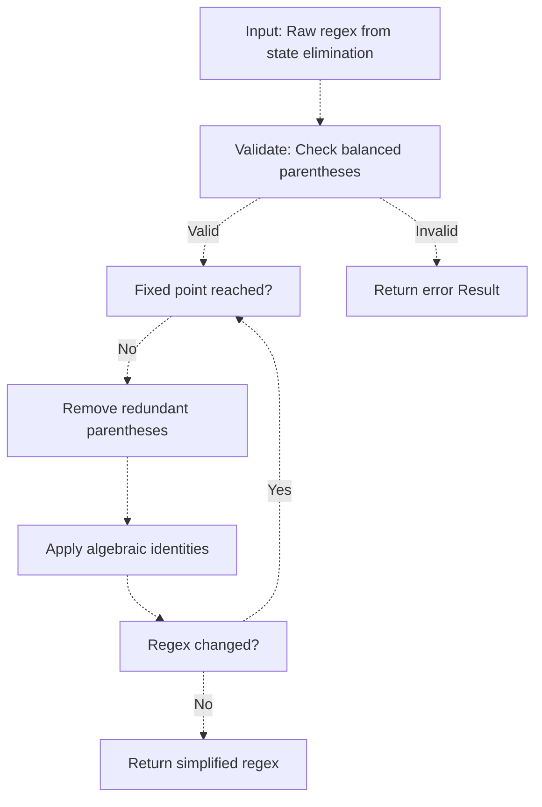

# Regex Simplification Rules

> **Relevant source files**
> * [lib/core/algorithms/regex_simplifier.dart](https://github.com/ThalesMMS/JFlutter/blob/main/lib/core/algorithms/regex_simplifier.dart)
> * [lib/core/algorithms/fa_to_regex_converter.dart](https://github.com/ThalesMMS/JFlutter/blob/main/lib/core/algorithms/fa_to_regex_converter.dart)
> * [test/unit/core/algorithms/regex_simplifier_test.dart](https://github.com/ThalesMMS/JFlutter/blob/main/test/unit/core/algorithms/regex_simplifier_test.dart)

This document describes the algebraic simplification rules applied to regular expressions produced by JFlutter's state elimination algorithm. The `RegexSimplifier` class transforms verbose, parenthesis-heavy regex output into cleaner, more readable expressions while preserving semantic equivalence.

---

## Overview

The regex simplification system addresses a common pain point with JFLAP's DFA-to-regex converter: the output is often cluttered with unnecessary parentheses and redundant constructs. JFlutter's simplifier applies three categories of transformations:

1. **Parentheses Removal** - Eliminates outer, nested, and redundant parentheses
2. **Algebraic Identities** - Applies formal language theory identities (∅, ε elimination, idempotence)
3. **Iterative Refinement** - Repeats transformations until a fixed point (no more changes)

All simplifications preserve language equivalence: the simplified regex accepts exactly the same strings as the original.

---

## Algorithm Architecture



The simplifier uses a do-while loop that alternates between parentheses removal and algebraic identity application until no further changes occur. This iterative approach handles complex expressions where one simplification enables another.

**Implementation Pattern:**

```dart
String simplified = regex;
String previous;

do {
  previous = simplified;
  simplified = _removeRedundantParentheses(simplified);
  simplified = _applyAlgebraicIdentities(simplified);
} while (simplified != previous);
```

**Source:** [lib/core/algorithms/regex_simplifier.dart L44-L48](https://github.com/ThalesMMS/JFlutter/blob/main/lib/core/algorithms/regex_simplifier.dart#L44-L48)

---

## Parentheses Removal Rules

### Rule 1: Outer Parentheses Elimination

Remove parentheses that wrap the entire expression when they serve no grouping purpose.

| Before | After | Rationale |
| --- | --- | --- |
| `(a)` | `a` | Outer parentheses add no information |
| `(a\|b)` | `a\|b` | Entire expression wrapped |
| `(ab)` | `ab` | Concatenation doesn't need grouping |
| `(a)*` | `a*` | Single symbol with Kleene star |

**Exception:** Parentheses are retained when followed by operators that apply to the entire group:

```
(a|b)*  →  (a|b)*   (kept - star applies to union)
(ab)+   →  (ab)+    (kept - plus applies to concatenation)
```

**Source:** [lib/core/algorithms/regex_simplifier.dart L118-L163](https://github.com/ThalesMMS/JFlutter/blob/main/lib/core/algorithms/regex_simplifier.dart#L118-L163)

---

### Rule 2: Nested Parentheses Reduction

Remove redundant layers of parentheses around single symbols or simple expressions.

| Before | After | Rationale |
| --- | --- | --- |
| `((a))` | `a` | Double wrapping unnecessary |
| `(((a\|b)))` | `a\|b` | Triple nesting simplified |
| `((a))*` | `a*` | Inner parentheses removed, outer kept for star |

The algorithm identifies matching parenthesis pairs using depth tracking and recursively removes unnecessary layers.

---

### Rule 3: Single Symbol Parentheses in Concatenation

Remove parentheses around single symbols when they appear in concatenation contexts.

| Before | After | Rationale |
| --- | --- | --- |
| `(a)(b)` | `ab` | Parentheses add no grouping value |
| `a(b)c` | `abc` | Middle symbol doesn't need parentheses |
| `(a)b(c)` | `abc` | All single symbols, remove all |

**Exception:** Parentheses are retained when followed by operators:

```
(a)*(b)  →  a*b    (first kept for star, second removed)
(a)|(b)  →  a|b    (both removed - union is explicit)
```

**Implementation:** The `_isSingleSymbol` helper determines if a string represents a single symbol (single character, ε, λ) or a complex expression requiring parentheses.

**Source:** [lib/core/algorithms/regex_simplifier.dart L165-L213](https://github.com/ThalesMMS/JFlutter/blob/main/lib/core/algorithms/regex_simplifier.dart#L165-L213)

---

## Algebraic Identity Rules

### Empty Set (∅) Identities

These rules handle the empty set symbol, which represents the empty language (no strings accepted).

#### Identity 1: Kleene Star of Empty Set

**Rule:** `∅* → ε`

**Rationale:** The Kleene star of the empty set contains only the empty string.

**Example:**
```
Before: a∅*b
After:  aεb  →  ab  (via epsilon elimination)
```

---

#### Identity 2: Union with Empty Set

**Rule:** `r|∅ → r` and `∅|r → r`

**Rationale:** Unioning any language with the empty set yields the original language.

**Examples:**

| Before | After | Rationale |
| --- | --- | --- |
| `a\|∅` | `a` | Right operand removed |
| `∅\|b` | `b` | Left operand removed |
| `(a\|b)\|∅` | `a\|b` | Trailing empty set removed |
| `∅\|(a\|∅)` | `a` | Multiple applications |

---

#### Identity 3: Concatenation with Empty Set

**Rule:** `r∅ → ∅` and `∅r → ∅`

**Rationale:** Concatenating any language with the empty set results in the empty set (no strings can be formed).

**Examples:**

| Before | After | Rationale |
| --- | --- | --- |
| `a∅` | `∅` | Right concatenation |
| `∅b` | `∅` | Left concatenation |
| `ab∅c` | `∅` | Entire concatenation becomes empty |

**Source:** [lib/core/algorithms/regex_simplifier.dart L279-L339](https://github.com/ThalesMMS/JFlutter/blob/main/lib/core/algorithms/regex_simplifier.dart#L279-L339)

---

### Epsilon (ε) Identities

These rules simplify expressions involving epsilon (the empty string).

#### Identity 4: Kleene Star of Epsilon

**Rule:** `ε* → ε`

**Rationale:** The Kleene star of epsilon contains only epsilon (since ε concatenated with itself is still ε).

**Example:**
```
Before: aε*b
After:  aεb  →  ab  (via epsilon concatenation elimination)
```

---

#### Identity 5: Concatenation with Epsilon

**Rule:** `rε → r` and `εr → r`

**Rationale:** Concatenating any language with epsilon leaves the language unchanged (epsilon is the identity element for concatenation).

**Examples:**

| Before | After | Rationale |
| --- | --- | --- |
| `aε` | `a` | Right epsilon removed |
| `εb` | `b` | Left epsilon removed |
| `aεb` | `ab` | Middle epsilon removed |
| `εaεbε` | `ab` | Multiple epsilons removed |

**Important:** Epsilon is NOT removed when it's:
- The only element: `ε` → `ε` (not simplified away)
- Part of a union: `a|ε` → `a|ε` (kept - represents optional 'a')

**Source:** [lib/core/algorithms/regex_simplifier.dart L369-L424](https://github.com/ThalesMMS/JFlutter/blob/main/lib/core/algorithms/regex_simplifier.dart#L369-L424)

---

### Idempotence Rules

These rules eliminate redundant repetitions of operations.

#### Identity 6: Multiple Kleene Stars

**Rule:** `r** → r*`, `r*** → r*`, etc.

**Rationale:** Applying Kleene star multiple times is equivalent to applying it once.

**Examples:**

| Before | After | Rationale |
| --- | --- | --- |
| `a**` | `a*` | Double star reduced |
| `(a\|b)***` | `(a\|b)*` | Triple star reduced |
| `a*****` | `a*` | Five stars reduced to one |

**Source:** [lib/core/algorithms/regex_simplifier.dart L439-L459](https://github.com/ThalesMMS/JFlutter/blob/main/lib/core/algorithms/regex_simplifier.dart#L439-L459)

---

#### Identity 7: Union Idempotence

**Rule:** `r|r → r`

**Rationale:** Unioning a language with itself yields the same language.

**Examples:**

| Before | After | Rationale |
| --- | --- | --- |
| `a\|a` | `a` | Duplicate removed |
| `(ab)\|(ab)` | `ab` | Duplicate expression removed |
| `a\|b\|a` | `a\|b` | First and third are duplicates |
| `(a\|b)\|(a\|b)\|c` | `(a\|b)\|c` | Duplicate union removed |

**Implementation Note:** The simplifier splits the regex by top-level `|` operators, removes duplicate segments while preserving order, then rejoins with `|`.

**Source:** [lib/core/algorithms/regex_simplifier.dart L461-L484](https://github.com/ThalesMMS/JFlutter/blob/main/lib/core/algorithms/regex_simplifier.dart#L461-L484)

---

## Complex Simplification Examples

### Example 1: State Elimination Output

**Before (raw state elimination):**
```
((a)|(b))*((c)(d))
```

**After simplification:**
```
(a|b)*cd
```

**Transformations applied:**
1. Remove parentheses around single symbols: `(a)|(b)` → `a|b`
2. Remove parentheses around single symbols: `(c)(d)` → `cd`
3. Outer parentheses kept for star: `(a|b)*`

---

### Example 2: Multiple Algebraic Identities

**Before:**
```
(a|∅)ε(b**)(c|c)
```

**After:**
```
ab*c
```

**Transformations applied:**
1. Union with empty set: `a|∅` → `a`
2. Concatenation with epsilon: `aε` → `a`
3. Multiple Kleene stars: `b**` → `b*`
4. Union idempotence: `c|c` → `c`
5. Remove outer parentheses

---

### Example 3: Nested Complexity

**Before:**
```
(((a)*)|(ε))((b)|((c)))
```

**After:**
```
(a*|ε)(b|c)
```

**Transformations applied:**
1. Remove innermost parentheses around `a`: `(a)*` → `a*`
2. Remove middle layer: `((a*)` → `(a*`
3. Keep outer layer for union: `(a*|ε)`
4. Remove parentheses around `b`: `(b)` → `b`
5. Remove nested parentheses around `c`: `((c))` → `c`
6. Keep outer grouping for concatenation: `(b|c)`

---

## Usage in JFlutter

### Programmatic API

The simplifier is integrated into the FA-to-regex converter:

```dart
// Without simplification (original behavior)
final result = FAToRegexConverter.convert(fa);

// With simplification (new feature)
final result = FAToRegexConverter.convert(fa, simplify: true);
```

**Source:** [lib/core/algorithms/fa_to_regex_converter.dart L26-L59](https://github.com/ThalesMMS/JFlutter/blob/main/lib/core/algorithms/fa_to_regex_converter.dart#L26-L59)

---

### UI Toggle

Users can toggle between simplified and raw output in the Regex page:

1. Convert a DFA/NFA to regex using the "Convert to Regex" button
2. Navigate to the Regex page
3. Use the "Simplify Output" toggle to switch between versions
4. Both versions are displayed with copy-to-clipboard functionality

The toggle allows students to see the algorithmic output (raw) and the cleaned-up version (simplified) side-by-side for educational purposes.

---

## Semantic Equivalence Guarantee

**Critical Property:** All simplifications preserve language equivalence.

The test suite at [test/unit/core/algorithms/regex_simplifier_test.dart](https://github.com/ThalesMMS/JFlutter/blob/main/test/unit/core/algorithms/regex_simplifier_test.dart) includes semantic equivalence tests that:

1. Convert the original regex to an NFA (via Thompson construction)
2. Convert the simplified regex to an NFA
3. Use `EquivalenceChecker.areEquivalent()` to verify both NFAs accept the same language

**Example test:**

```dart
test('semantically equivalent after parentheses removal', () {
  final original = '((a)|(b))';
  final result = RegexSimplifier.simplify(original);

  expect(result.isSuccess, true);
  final simplified = result.value!;

  // Convert both to NFAs and verify equivalence
  final originalNFA = RegexToNFAConverter.convert(original).value!;
  final simplifiedNFA = RegexToNFAConverter.convert(simplified).value!;

  final equiv = EquivalenceChecker.areEquivalent(originalNFA, simplifiedNFA);
  expect(equiv.value, true);
});
```

**Source:** [test/unit/core/algorithms/regex_simplifier_test.dart](https://github.com/ThalesMMS/JFlutter/blob/main/test/unit/core/algorithms/regex_simplifier_test.dart)

---

## Comparison with JFLAP

| Aspect | JFLAP Output | JFlutter Simplified Output |
| --- | --- | --- |
| **Parentheses** | Heavy use of redundant parentheses | Minimal, only where necessary |
| **Algebraic Identities** | Not applied | Fully applied |
| **Readability** | Difficult to parse visually | Clean and concise |
| **Semantic Equivalence** | Correct but verbose | Correct and simplified |
| **Educational Value** | Shows raw algorithm output | Shows both raw and simplified |

**Example Comparison:**

For a DFA accepting strings with an even number of 'a's:

```
JFLAP:     ((∅|ε)|(((a)(a))*)
JFlutter:  ε|(aa)*
```

Both are semantically equivalent, but JFlutter's output is significantly more readable for students.

---

## Implementation Details

### Fixed Point Iteration

The simplifier uses a fixed-point algorithm: transformations are applied repeatedly until the regex stops changing. This handles cases where one simplification enables another.

**Example:**

```
Initial:     (((a)|ε)*)
Iteration 1: ((a|ε)*)      (remove inner parens around a)
Iteration 2: (a|ε)*        (remove middle parens)
Fixed point: (a|ε)*        (no more changes)
```

---

### Parentheses Balancing Validation

Before simplification, the algorithm validates that parentheses are balanced:

```dart
int count = 0;
for (int i = 0; i < regex.length; i++) {
  if (regex[i] == '(') count++;
  else if (regex[i] == ')') {
    count--;
    if (count < 0) return error; // Unmatched closing paren
  }
}
if (count != 0) return error; // Unclosed opening paren
```

**Source:** [lib/core/algorithms/regex_simplifier.dart L72-L94](https://github.com/ThalesMMS/JFlutter/blob/main/lib/core/algorithms/regex_simplifier.dart#L72-L94)

---

### Depth Tracking for Matching Parentheses

The `_findMatchingCloseParen` helper uses depth tracking to find matching parenthesis pairs:

```dart
int depth = 0;
for (int i = openIndex; i < regex.length; i++) {
  if (regex[i] == '(') depth++;
  else if (regex[i] == ')') {
    depth--;
    if (depth == 0) return i; // Found matching close paren
  }
}
```

This enables safe parentheses removal without breaking nested structures.

**Source:** [lib/core/algorithms/regex_simplifier.dart L215-L229](https://github.com/ThalesMMS/JFlutter/blob/main/lib/core/algorithms/regex_simplifier.dart#L215-L229)

---

## Testing Strategy

The simplifier has comprehensive test coverage across three test files:

1. **Unit Tests** ([regex_simplifier_test.dart](https://github.com/ThalesMMS/JFlutter/blob/main/test/unit/core/algorithms/regex_simplifier_test.dart))
   - 33 tests covering all simplification rules
   - Parentheses removal (15 tests)
   - Empty set identities (6 tests)
   - Epsilon identities (5 tests)
   - Idempotence (4 tests)
   - Error handling (3 tests)

2. **Semantic Equivalence Tests** (same file)
   - 18 tests verifying language preservation
   - Uses NFA conversion + equivalence checking

3. **Integration Tests** ([fa_to_regex_simplified_test.dart](https://github.com/ThalesMMS/JFlutter/blob/main/test/unit/core/algorithms/fa_to_regex_simplified_test.dart))
   - 18 tests for FA→Regex with simplification
   - Basic simplification, algebraic identities, round-trip conversion
   - Complex FA scenarios, edge cases, performance tests

---

## Performance Characteristics

| Aspect | Complexity | Notes |
| --- | --- | --- |
| **Time Complexity** | O(n × k) | n = regex length, k = iteration count (typically small) |
| **Space Complexity** | O(n) | Intermediate string copies |
| **Fixed Point Iterations** | Typically 2-4 | Depends on nesting depth and identity density |
| **Worst Case** | O(n²) | Deeply nested expressions with many identities |

For typical regex output from state elimination (10-100 characters), simplification is near-instantaneous (< 1ms).

---

## Future Enhancements

Potential improvements to the simplifier:

1. **Advanced Identities**
   - Distributivity: `a(b|c) → ab|ac`
   - Absorption: `a|ab → a`, `a(a|b) → a(a|b)` (context-dependent)

2. **Order Optimization**
   - Sort union terms alphabetically: `b|a → a|b`
   - Canonicalization for better comparison

3. **User Preferences**
   - Configurable simplification aggressiveness
   - Option to prefer certain forms (e.g., `a*` vs `ε|aa*`)

4. **AST-Based Simplification**
   - Parse regex into AST, simplify structure, serialize
   - More robust than string manipulation

---

## References

* **Theoretical Foundation:** Kozen, D. (1997). *Automata and Computability*. Springer. Chapter 4: Regular Expressions.
* **Algorithm Pattern:** Follows standard fixed-point iteration for term rewriting systems
* **JFLAP Comparison:** JFLAP 7.1 (www.jflap.org) - state elimination output without simplification

---

### On this page

* [Regex Simplification Rules](#regex-simplification-rules)
* [Overview](#overview)
* [Algorithm Architecture](#algorithm-architecture)
* [Parentheses Removal Rules](#parentheses-removal-rules)
  * [Rule 1: Outer Parentheses Elimination](#rule-1-outer-parentheses-elimination)
  * [Rule 2: Nested Parentheses Reduction](#rule-2-nested-parentheses-reduction)
  * [Rule 3: Single Symbol Parentheses in Concatenation](#rule-3-single-symbol-parentheses-in-concatenation)
* [Algebraic Identity Rules](#algebraic-identity-rules)
  * [Empty Set (∅) Identities](#empty-set--identities)
  * [Epsilon (ε) Identities](#epsilon--identities)
  * [Idempotence Rules](#idempotence-rules)
* [Complex Simplification Examples](#complex-simplification-examples)
* [Usage in JFlutter](#usage-in-jflutter)
* [Semantic Equivalence Guarantee](#semantic-equivalence-guarantee)
* [Comparison with JFLAP](#comparison-with-jflap)
* [Implementation Details](#implementation-details)
* [Testing Strategy](#testing-strategy)
* [Performance Characteristics](#performance-characteristics)
* [Future Enhancements](#future-enhancements)
* [References](#references)
